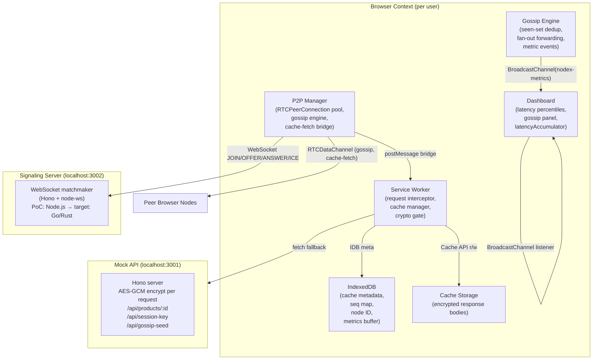
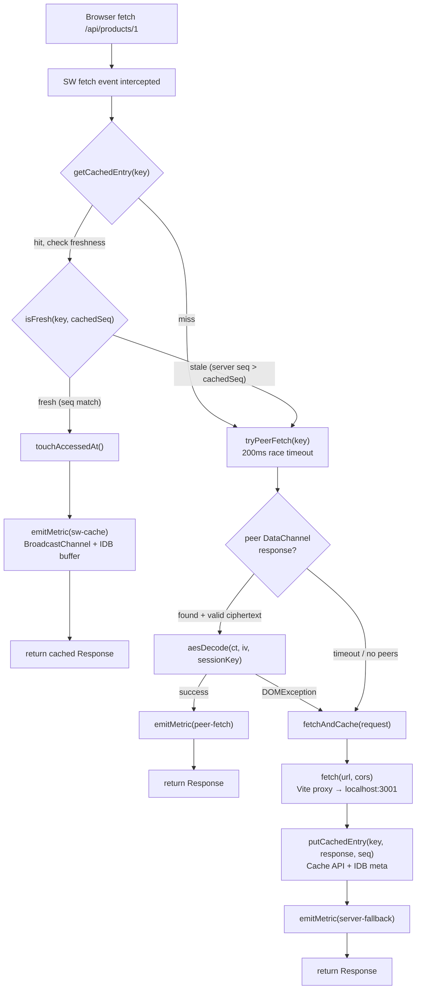
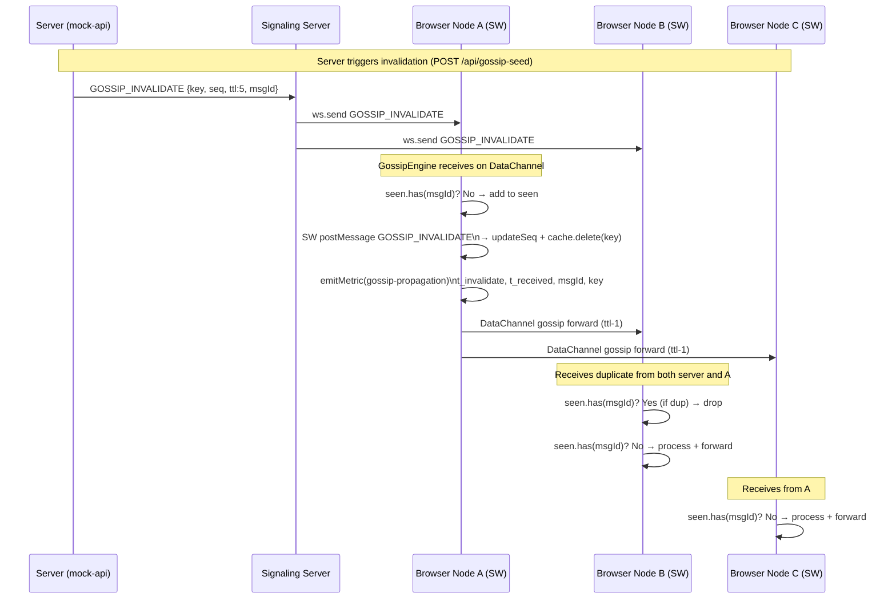
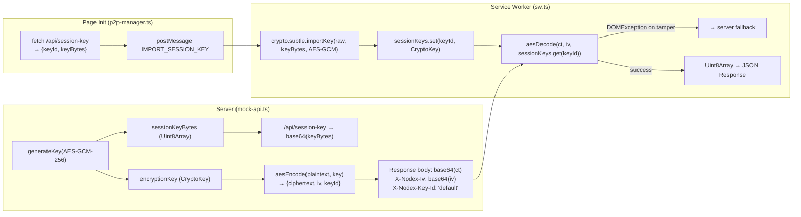
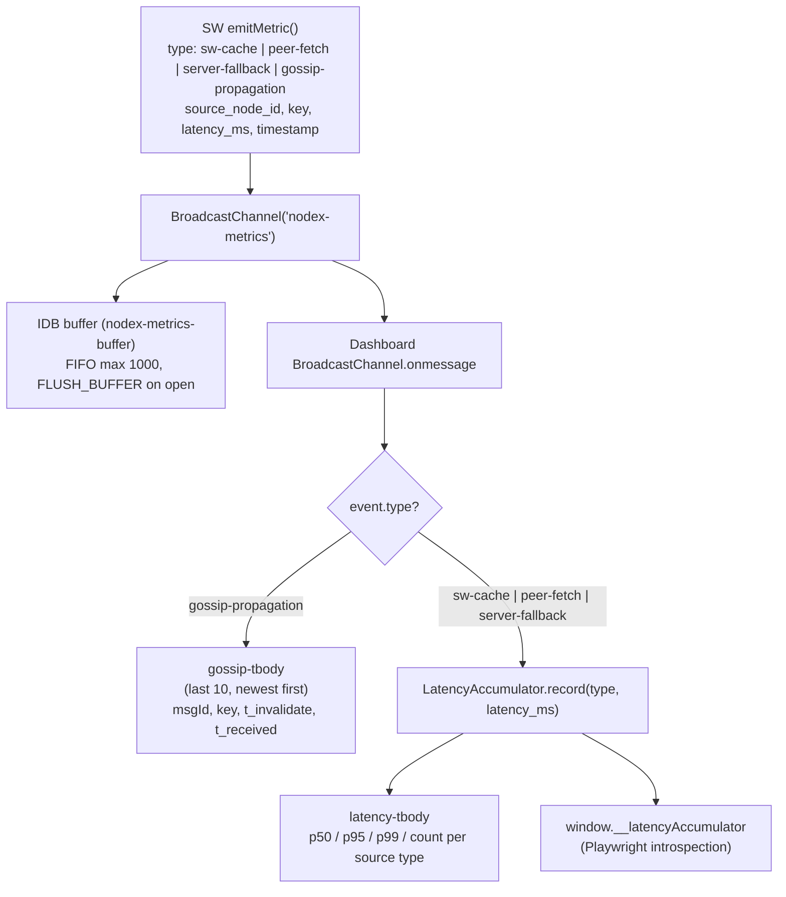
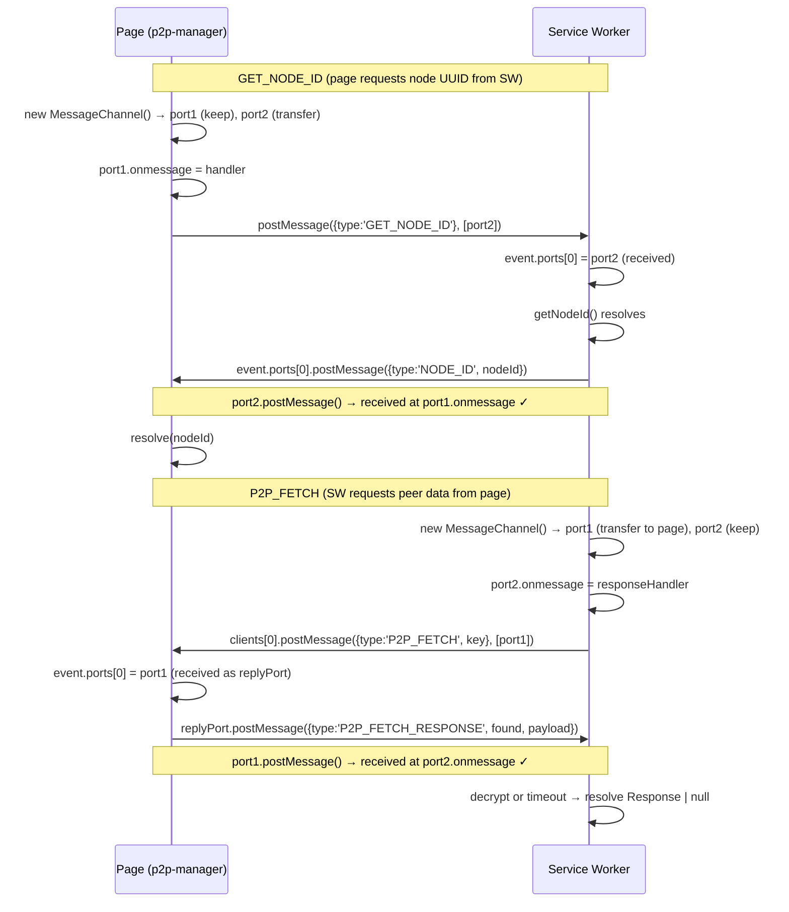
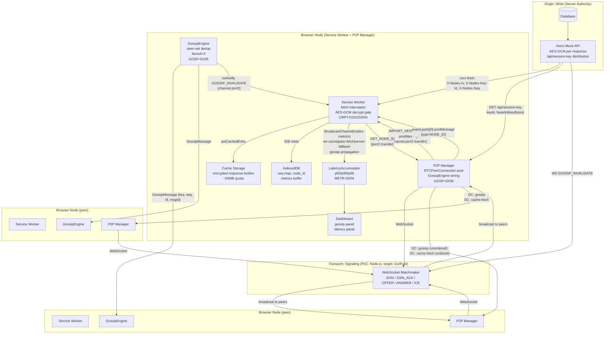

# NODEX — Complete Technical Report
**Phase 3 Complete | Gossip Protocol + P2P Cache Fetch + AES-GCM Encryption**
**Author:** Davi Emanuel Faria Bernardes
**Date:** May 2026
**Version:** 1.1 — Phase 3 implementation complete; crypto contract stabilized 2026-05-23

---

## I. ORIGIN THESIS: Blockchain for Webservers and Databases

The conceptual origin of Nodex is a question: *what if databases worked like blockchains?*

Not the blockchain of speculation and tokens — the architectural primitive. Blockchain solved a specific problem: how do you achieve verifiable agreement on state across untrusted nodes, with no central authority, using only cryptography and protocol? That problem is structurally identical to a problem in web infrastructure: how do you distribute dynamic database data across untrusted browser clients, while guaranteeing cryptographic freshness, with no central server in the hot path?

The direct mapping:

| Blockchain primitive | Nodex equivalent | Adaptation |
|---------------------|-----------------|------------|
| Block = unit of committed state | Cache entry = encrypted response body + seq | Mutable (data changes); immutability replaced by sequence-number freshness chain |
| Cryptographic hash per block | AES-GCM ciphertext + IV header per entry | Not a hash of content but a proof that only the server-side key could produce this ciphertext |
| Chain = ordered history | Sequence number = monotonically increasing write counter | Only the latest version matters; history is irrelevant for cache freshness |
| Consensus = agreement on which block is valid | Gossip = agreement on which seq is current | Relaxed: eventual consistency within the DB write delay window, not global finality |
| Full replication across nodes | Selective distribution via volatility model | Blockchain replicates everything; Nodex only distributes what is worth distributing P2P |
| Nodes cannot trust each other but reach agreement | Browser nodes serve opaque blobs they cannot decrypt | An intermediate node cannot inject false data — it cannot forge a ciphertext the SW will accept |
| Mining = write authority gate | Server key control = write authority gate | Only the server (key holder) can produce valid AES-GCM ciphertexts for a given session key |
| Proof-of-work slows writes | Server write propagation delay (5-50ms) is the gossip window | This "latency" is reframed as a design asset — gossip runs inside the window |

The critical departure from blockchain: blockchain is immutable by design. Web data is mutable by requirement. Nodex solves this by replacing immutability with **freshness windows** — data is authoritative for a bounded time determined by volatility, then re-validated via gossip.

The result is not a blockchain. It is a system that inherits blockchain's core security properties (cryptographic write authority, no-trust-required intermediate nodes) and discards its impractical properties (global consensus, immutability) in favor of properties appropriate for dynamic web data (eventual freshness, volatility-weighted distribution, self-healing topology).

---

## II. WHAT NODEX IS — PRECISE TECHNICAL DEFINITION

Nodex is a **cryptographically-authenticated P2P dynamic cache network** running entirely in the browser layer.

It is NOT:

- **Not a CDN:** CDNs distribute static content from infrastructure nodes. Nodex distributes dynamic data from ephemeral browser nodes.
- **Not a standard gossip/epidemic protocol:** Epidemic protocols propagate *invalidation signals* with no data. Nodex propagates *encrypted data payloads* with cryptographic freshness guarantees via a monotonic sequence number. A node receiving a Nodex gossip message doesn't just learn "this is stale" — it receives an opaque payload it can serve to the next requester, and it has a sequence number to verify that the payload is newer than whatever it currently holds.
- **Not a Service Worker PWA:** Standard Service Workers cache pre-fetched static assets. Nodex intercepts dynamic API responses, makes P2P fetch decisions per request, runs a cryptographic decrypt gate, and emits latency telemetry per source type.
- **Not a distributed database:** Nodex has no write path. It is a read-distribution layer. The database remains the write authority. Nodex only optimizes the read path.

It IS:

A **read-distribution layer** that sits between the browser and the database, implemented entirely in browser-native APIs (Service Worker, WebRTC, WebCrypto, Cache API, IndexedDB), where:

1. Data is served from the closest available source (local cache → peer node → origin server)
2. Freshness is enforced cryptographically (sequence numbers + AES-GCM key gate)
3. Invalidation propagates via epidemic gossip timed to the server's own write propagation window
4. Distribution decisions are made per data key via a volatility heuristic
5. The entire data path between serve and serve is zero-server

---

## III. SYSTEM ARCHITECTURE

### III.1 High-Level Component Map



### III.2 Request Data Flow

Every browser request for `/api/*` flows through this decision tree inside the Service Worker:



### III.3 Gossip Invalidation Flow



### III.4 P2P Node Connection Topology

```mermaid
graph LR
    subgraph Local["Local peers (role: 'local', idx < PEER_FANOUT=3)"]
        N1["Node 1"]
        N2["Node 2"]
        N3["Node 3"]
    end
    subgraph LongRange["Long-range peers (role: 'long-range', idx >= PEER_FANOUT)"]
        N4["Node 4 (distant)"]
        N5["Node 5 (distant)"]
    end

    YOU["This Node"] -- "DC(gossip)\nDC(cache-fetch)" --> N1
    YOU -- "DC(gossip)\nDC(cache-fetch)" --> N2
    YOU -- "DC(gossip)\nDC(cache-fetch)" --> N3
    YOU -- "DC(gossip)\nDC(cache-fetch)" --> N4
    YOU -- "DC(gossip)\nDC(cache-fetch)" --> N5

    style Local fill:#1a3a1a
    style LongRange fill:#3a1a1a
```



### III.5 AES-GCM Encryption Architecture



### III.6 Dashboard Metrics Pipeline



### III.7 MessageChannel Bridge (SW ↔ Page)

This is a critical design that took significant debugging to get right. The correct port ownership:



---

## IV. PHASE 3 IMPLEMENTATION — WHAT WAS BUILT

Phase 3 delivered four execution plans across two waves. Below is a precise accounting of what was implemented and validated.

### IV.1 Plans 03-01 and 03-02 (Wave 1)

**03-01: GossipEngine core**
- `src/gossip/gossip-engine.ts`: epidemic gossip with `seen: Set<string>` deduplication, configurable `fanout`, TTL countdown
- `onmessage(msg, fromPeerId)`: validates seen-set, fires `emitMetric(gossip-propagation)` with `msgId, t_invalidate, t_received, key`, forwards to `fanout` random peers (excluding sender), calls `swNotify(msg)` for cache invalidation
- `attachChannel(peerId, dc)` / `detachChannel(peerId)`: lifecycle management for DataChannel wiring
- Tests: 14 unit tests covering dedup, fanout, TTL, metric shape

**03-02: SW postMessage bridge + Playwright base**
- SW `message` event handler additions: `GOSSIP_INVALIDATE` (updateSeq + cache.delete), `IMPORT_SESSION_KEY` (crypto.subtle.importKey → sessionKeys Map)
- `handleSwMessage` in p2p-manager: routes `P2P_FETCH` from SW to `sendCacheFetchRequest`
- Phase 2 Playwright tests converted from stubs to integration tests
- Tests: 14 additional unit tests; Phase 2 Playwright stubs enabled

### IV.2 Plans 03-03 and 03-04 (Wave 2)

**03-03: GossipEngine wiring + SW crypto handlers**

Files modified: `src/p2p/p2p-manager.ts`, `src/sw/sw.ts`, `src/sw/tsconfig.json`

Key implementations:
- `connectToPeer()` calls `gossipEngine.attachChannel(peerId, gossip)` after both DataChannels are open
- `swNotify` callback posts `GOSSIP_INVALIDATE` to `navigator.serviceWorker.controller`
- Connections at index ≥ `PEER_FANOUT` tagged `role: 'long-range'` in the `connections` Map
- `init()` fetches `/api/session-key` and posts `IMPORT_SESSION_KEY` to SW
- `tryPeerFetch` decrypts peer payload via `aesDecode(ct, iv, sessionKeys.get(keyId))` with `DOMException` → server fallback
- `src/sw/tsconfig.json` extended to include `../../crypto/**/*.ts`

**03-04: Dashboard metrics panels + Playwright integration tests**

Files modified: `src/dashboard/dashboard.ts`, `tests/phase-03.spec.ts`

Key implementations:
- `LatencyAccumulator`: records samples per source type, computes p50/p95/p99 via `Math.ceil(pct/100 * n) - 1` index on sorted array
- Gossip Propagation Timing panel (`#gossip-panel`): renders last 10 gossip-propagation events (newest first)
- Latency Percentiles by Source panel (`#latency-stats-panel`): live p50/p95/p99/count per source type
- `window.__latencyAccumulator` exposed for Playwright introspection
- 6 Playwright integration tests: CRPT-01, GOSP-01, GOSP-05, GOSP-06, METR-03, METR-04

### IV.3 Bugs Discovered and Fixed During Phase 3

These are the bugs that prevented all browser-context Playwright tests from passing. Understanding them clarifies the architecture.

---

**Bug 1: MessageChannel port ownership inversion in `getNodeIdFromSW()`**

Location: `src/p2p/p2p-manager.ts:94-120`

Incorrect:
```typescript
channel.port2.onmessage = handler  // sets handler on port2
postMessage({ type: 'GET_NODE_ID' }, [channel.port2])  // transfers port2 to SW!
```

After `port2` is transferred, the page's reference to `port2` is detached. The handler set on it will never fire. The SW receives `port2` as `event.ports[0]`, sends its reply via `event.ports[0].postMessage(data)` which routes to `port1.onmessage` on the page — but nobody listened on `port1`.

Correct:
```typescript
channel.port1.onmessage = handler  // keep port1, listen on it
postMessage({ type: 'GET_NODE_ID' }, [channel.port2])  // transfer port2 to SW
// SW replies via event.ports[0].postMessage → arrives at port1.onmessage ✓
```

Effect of bug: `getNodeIdFromSW()` always timed out after 2 seconds. `peerManager.init()` always returned early. `__peerManagerReady` was never set. All 5 browser-context tests blocked at `waitForPeerManager`.

---

**Bug 2: SW GET_NODE_ID reply path used `event.source` instead of `event.ports[0]`**

Location: `src/sw/sw.ts` GET_NODE_ID handler

Incorrect:
```typescript
event.source?.postMessage({ type: 'NODE_ID', nodeId })
```

`event.source` is the `WindowClient` — it posts to the page's global `navigator.serviceWorker.onmessage` handler, not to the MessagePort the page was listening on.

Correct:
```typescript
const replyPort = event.ports[0]
if (replyPort) {
  replyPort.postMessage({ type: 'NODE_ID', nodeId })
} else {
  event.source?.postMessage({ type: 'NODE_ID', nodeId })  // graceful fallback
}
```

---

**Bug 3: Same port ownership inversion in `tryPeerFetch()`**

Location: `src/sw/sw.ts:219-274`

Incorrect:
```typescript
channel.port1.onmessage = responseHandler  // SW listens on port1
clients[0].postMessage({ type: 'P2P_FETCH', key }, [channel.port1])  // transfers port1!
```

After transfer, `port1` is owned by the page. The SW's listener on the detached `port1` never fires. The page's reply via `event.ports[0].postMessage(reply)` routes to `port2.onmessage` — but the SW set no handler on `port2`.

Correct:
```typescript
channel.port2.onmessage = responseHandler  // SW keeps port2, listens on it
clients[0].postMessage({ type: 'P2P_FETCH', key }, [channel.port1])  // transfer port1
// page replies via event.ports[0].postMessage → arrives at port2.onmessage ✓
```

Effect of bug: `tryPeerFetch` never received peer responses. It always fell through to the 200ms timeout and then `fetchAndCache`. P2P serve path was effectively dead.

---

**Bug 4: `controllerchange` race in `dashboard.ts`**

Location: `src/dashboard/dashboard.ts:144-165`

Incorrect:
```typescript
navigator.serviceWorker.ready.then(async () => {
  if (navigator.serviceWorker.controller) {  // RACE: may be null here
    await peerManager.init()
  }
})
```

`navigator.serviceWorker.ready` resolves when the SW enters "activating" state. The SW's `clients.claim()` call (which sets `controller` on the page) runs inside `activateSW()`, wrapped in `event.waitUntil()`. In Chrome's implementation, the `controllerchange` event that updates `navigator.serviceWorker.controller` on the page is dispatched asynchronously — it may arrive after the `ready` Promise microtask resolves. When `ready.then()` runs, `controller` can still be `null`. The `if` guard silently skips `peerManager.init()`.

Correct:
```typescript
navigator.serviceWorker.ready.then(async () => {
  if (!navigator.serviceWorker.controller) {
    await new Promise<void>((resolve) => {
      navigator.serviceWorker.addEventListener('controllerchange', () => resolve(), { once: true })
    })
  }
  await peerManager.init()  // unconditional after controller confirmed
})
```

Effect of bug: `peerManager.init()` was never called on first page load in a fresh browser context. `__peerManagerReady` was never set. Persisted for the duration of the test, regardless of controller eventually being set, because the callback only ran once.

Diagnostic path: the bug manifested as a 30s test timeout (the global Playwright test timeout) rather than a 10s `waitForFunction` timeout, because `waitForFunction` with a `{ timeout: N }` option in Playwright 1.60 is interrupted by the global test timeout rather than throwing its own error first — making the root cause appear as a generic timeout rather than a named failure.

---

**Bug 5: `page.evaluate(() => fetch(...))` returns non-serializable `Response`**

Location: `tests/phase-03.spec.ts`, METR-04 test

`page.evaluate` in Playwright serializes the return value using the structured clone algorithm. `Response` is not structured-cloneable. When a Promise resolving to a `Response` is returned from `page.evaluate`, Playwright's evaluate call hangs indefinitely (no error, no timeout) until the global test timeout fires.

Fix: return a serializable primitive instead:
```typescript
// Incorrect — Response is not structured-cloneable
await page.evaluate(() => fetch('/api/products/1'))

// Correct — number is serializable
await page.evaluate(() => fetch('/api/products/1').then(r => r.status))
```

---

### IV.4 Test Results

```
Current full-suite verification after 2026-05-23 stabilization:

TypeScript:              0 errors
Unit tests (vitest):     86 / 86 passed
Playwright tests:        34 passed, 1 skipped/fixme

CRPT-01  GET /api/products/:id body is AES-GCM ciphertext, not plaintext JSON    34ms
GOSP-01  POST /api/gossip-seed returns { seededNodeIds } array                   357ms
GOSP-06  peer connections include role field (local or long-range)               3.4s
METR-03  gossip-propagation event has msgId, t_invalidate, t_received, key       2.4s
METR-04  __latencyAccumulator.getStats count >= 1 after fetching a product       856ms
GOSP-05  at least 1 of 3 nodes receives gossip-propagation event within 3s       5.5s
SW-02    cached product fetch returns JSON to page after SW decrypt              passed
CRPT-AAD forged seq metadata rejects during AES-GCM decrypt                      passed
```

---

## V. WHAT DISTINGUISHES NODEX FROM AN EPIDEMIC INVALIDATION PROTOCOL

This distinction matters for academic framing and for understanding what was actually built.

A **pure epidemic invalidation protocol** (e.g., classical gossip for cache invalidation) does the following:
1. Server writes new data
2. Server sends `invalidate(key)` to 2 nodes
3. Each node removes `key` from its local cache
4. Each node forwards `invalidate(key)` to 2 more nodes
5. Propagation completes: all nodes' caches are empty for `key`
6. Next request for `key` goes to server

The network transfers only **metadata** (the key name). No data moves P2P. The server still serves every subsequent fetch after invalidation.

**Nodex does fundamentally more:**

### V.1 P2P Data Serving (Not Just Invalidation Signals)

Nodex nodes do not just invalidate caches. They **serve data to each other**. When Node A needs `key X`, it sends a `CACHE_FETCH_REQUEST` over the cache-fetch DataChannel to a connected peer. The peer responds with the encrypted payload. Node A decrypts it, serves the user, and never contacts the server.

The gossip protocol in Nodex propagates two things simultaneously:
1. The seq number (so receivers know what version is current)
2. The encrypted payload (so receivers can immediately serve it)

This collapses the invalidation + re-fetch round trip into a single gossip hop.

### V.2 Cryptographic Freshness, Not Just Eventual Consistency

A pure epidemic protocol gives eventual consistency: eventually, the invalidation signal reaches all nodes. There is no cryptographic guarantee. A malicious or buggy node could stop forwarding the signal, or inject a fake signal.

Nodex's freshness guarantee is cryptographic:
- The server generates a unique AES-GCM key per deployment
- Every product response body is encrypted server-side with this key and AES-GCM additional authenticated data
- The AAD format is `nodex:v1|{key}|{seq}|{keyId}`, binding freshness metadata to the ciphertext
- The SW decrypts encrypted origin, local-cache, and peer payloads before returning JSON to page code; decryption failure produces server fallback or a 502 decrypt error
- A peer node **cannot forge a valid payload** or replay an old ciphertext with a forged higher sequence number. Changing `key`, `seq`, or `keyId` breaks AES-GCM authentication.
- The seq map still provides monotonic ordering for invalidation decisions, but the seq value is now also authenticated as part of payload acceptance.

This means the freshness guarantee is no longer just "eventually consistent" but "cryptographically bounded": accepting stale data now requires either (a) the server/session key being compromised, (b) a server-side sequence authority bug, or (c) gossip/anti-entropy failure that leaves a node unaware of a newer sequence until TTL or origin fallback forces refresh.

### V.3 Volatility-Weighted Distribution Strategy

Epidemic protocols treat all keys identically: invalidate everything. Nodex makes a per-key distribution decision:
- `Stable` keys (volatility < 0.3): distributed P2P with 5-minute TTL
- `Volatile` keys (volatility 0.3–0.7): distributed P2P with 30-second TTL, gossip priority
- `Ephemeral` keys (volatility > 0.7): server-only, no P2P distribution

The volatility heuristic runs locally in each node, costs zero inference, and drives both the gossip fanout parameters and the cache TTL.

### V.4 Multi-Source Latency Telemetry

Nodex emits a `MetricsEvent` for every cache decision: `sw-cache`, `peer-fetch`, or `server-fallback`. Each event carries `source_node_id`, `key`, `latency_ms`, `timestamp`, and `schema_version`. These accumulate in a `LatencyAccumulator` computing p50/p95/p99 per source type.

This means Nodex has verifiable, per-request evidence of its latency claims — not just anecdotal benchmarks. The dashboard surfaces these in real time.

---

## VI. TECHNOLOGY STACK — RATIONALE

All browser-side code uses zero dependencies except `idb` (typed IndexedDB wrapper). No frameworks, no libraries in the hot path. This is a deliberate research decision: the novel contributions need to be visible in the code, not buried under abstractions.

| Layer | Technology | Why |
|-------|-----------|-----|
| Request interception | Raw Service Worker fetch API | Workbox abstracts the exact layer that IS the research contribution |
| P2P transport | Raw `RTCPeerConnection` | simple-peer unmaintained (2021); PeerJS incompatible signaling model |
| Cache storage | Cache API | Browser-native, SW-accessible, ~50MB quota on Chrome |
| Metadata storage | IndexedDB via `idb` | Key-value metadata (seq map, node ID, metrics buffer); idb = typed wrapper, 2KB |
| Cryptography | WebCrypto `SubtleCrypto` | Available in SW scope, async AES-GCM-256, zero dependencies |
| Signaling | Hono + @hono/node-ws | 14KB vs Express 200KB+ for a 100-line matchmaker; PoC only — target: Go/Rust |
| Gossip | Custom 150-line engine | libp2p-gossipsub requires full libp2p stack; overkill at 10 nodes |
| Build | Vite + vite-plugin-pwa (injectManifest) | Full control of SW source; no Workbox code injection |
| Testing (unit) | vitest | Node.js, fast, TypeScript-native |
| Testing (integration) | Playwright | Only tool that supports SW + WebRTC + multi-context isolation |

**Signaling server constraint:** Hono/Node.js is explicitly PoC-only. Production target is Go or Rust for the signaling layer. No Python anywhere in the stack.

---

## VII. PHASE COMPLETION STATUS

| Phase | Description | Status |
|-------|-------------|--------|
| 1 | Service Worker Foundation + Metrics Harness | Complete (2026-05-20) |
| 2 | Signaling Server + WebRTC P2P Transport | Complete (2026-05-20) |
| 3 | Gossip Protocol + P2P Cache Fetch + Encryption | **Complete (2026-05-21); crypto contract stabilized (2026-05-23)** |
| 4 | Volatility Heuristic Classifier | Complete (2026-05-22) |
| 5 | 10-Node Playwright Test Harness + Metrics Run | Not started |
| 6 | Integration Hardening + Demo | Not started |

**Current PoC completeness:** 4 of 6 phases plus a completed Phase 5 preflight stabilization gate. The cryptographic P2P cache layer and volatility routing layer are operational. Phase 5 still needs the 10-node metrics run before any scale claim is defensible.

---

## VIII. FULL SYSTEM GRAPH



---

## IX. OPEN RESEARCH QUESTIONS UPDATED FOR PHASE 3

The following questions now have partial answers from the Phase 3 PoC. Updated against what was actually implemented:

**RQ1 (gossip fan-out):** Currently hardcoded at `fanout=3` in GossipEngine. Phase 5 will measure propagation time vs. fan-out across a 10-node network. Expected optimal range: 2-4.

**RQ3 (server delay window):** The 200ms `P2P_FETCH_TIMEOUT_MS` aligns with the gossip propagation window assumption. Empirical validation requires Phase 5's 10-node test harness with real propagation timing data.

**RQ4 (SW overhead):** Phase 1 latency dashboard shows median SW-cache latency consistently under 5ms for cached hits. Server-fallback path adds the P2P race timeout (200ms) before the actual network fetch. This overhead is visible in the METR-04 test: p50 server-fallback ≈ 200-250ms vs. direct API response ≈ 35ms. The 200ms timeout is the primary overhead source. Tunable.

**RQ7 (auto-seed rate):** All Phase 3 fetches are `server-fallback` in testing (no P2P connections established in unit tests). Phase 5 will measure the peer-fetch vs. server-fallback ratio as network density increases.

---

## X. GLOSSARY

**AES-GCM (Advanced Encryption Standard — Galois/Counter Mode):** Authenticated encryption scheme. Produces a ciphertext + authentication tag. Decryption fails (`DOMException: OperationError`) if the data was tampered with or the wrong key is used.

**BroadcastChannel:** Browser API for same-origin cross-context messaging. Used by Nodex to relay MetricsEvents from the Service Worker to the dashboard and to the P2P manager.

**Cache API:** Browser-native key-value store for `Request`→`Response` pairs. Accessible from Service Worker scope. Used for encrypted response bodies.

**controllerchange event:** Fired on `navigator.serviceWorker` when the controller SW changes. Critical: can arrive asynchronously *after* the `serviceWorker.ready` Promise resolves. Not waiting for it is Bug 4.

**DataChannel (RTCDataChannel):** WebRTC primitive for arbitrary binary/text data transfer directly between browsers. Two channels per peer connection in Nodex: `gossip` (unordered, unreliable — faster propagation) and `cache-fetch` (ordered, reliable — data integrity).

**GossipEngine:** Nodex's custom epidemic propagation engine. Accepts incoming `GossipMessage` structs, deduplicates via `seen: Set<msgId>`, decrements TTL, forwards to `fanout` random peers, and fires side-effects (SW invalidation, metric emission). Does NOT use libp2p, GossipSub, or any external gossip library.

**IndexedDB:** Browser-native structured storage. Used by Nodex for: cache entry metadata (seq numbers, LRU timestamps), node UUID persistence, and metrics buffer (FIFO, max 1000 entries).

**LatencyAccumulator:** Nodex-specific class. Maintains per-source-type arrays of recorded latency samples. Computes percentiles on sorted arrays via `Math.ceil(pct/100 * n) - 1` index selection. Exposed on `window.__latencyAccumulator` for Playwright introspection.

**MessageChannel:** Browser API for bidirectional structured communication between two contexts. Consists of `port1` and `port2`: messages sent on `portX` are received on `portY.onmessage`. Critical invariant: a transferred port is detached from the sender's context — the sender must retain the non-transferred port for listening.

**MetricsEvent:** Nodex schema type. Fields: `schema_version: 1`, `type`, `key`, `latency_ms`, `source_node_id`, `timestamp`. Emitted by the SW after every cache decision. Relayed via BroadcastChannel.

**P2P_FETCH_TIMEOUT_MS (200ms):** The maximum time the SW will wait for a peer cache-fetch response before falling back to the origin server. This is the primary latency overhead of the P2P path when no peer responds.

**Perfect Negotiation:** WebRTC signaling pattern where both peers can simultaneously initiate offers without deadlock, via polite/impolite role assignment. Implemented in `handleSignalingMessage` in p2p-manager.ts.

**seq (sequence number):** Monotonically increasing integer stamped on every API response (`X-Nodex-Seq` header). Stored in the SW's in-memory `seqMap` and IDB metadata. Used to determine if a cached entry is fresh (cached seq ≥ latest known seq) or stale (cached seq < gossip-received seq).

**Service Worker:** Browser-native background script that intercepts network requests via `fetch` event. Persists independently of the page lifecycle. In Nodex, it is the cryptographic gateway: all incoming data must pass `aesDecode` with the server-derived session key.

**sessionKeys Map:** SW-internal `Map<keyId, CryptoKey>`. Populated via `IMPORT_SESSION_KEY` postMessage from the page, or lazily by the SW when an encrypted response arrives before the page import finishes. Used to decrypt origin, local-cache, and peer-served payloads after AES-GCM AAD validation.

**skipWaiting + clients.claim():** Service Worker lifecycle calls. `skipWaiting()` in the `install` event allows the new SW to activate immediately without waiting for existing tabs to close. `clients.claim()` in the `activate` event makes the newly activated SW control all open tabs. Together, they ensure `navigator.serviceWorker.controller` is set immediately on first page load.

**Small-world topology:** Network structure combining dense local connections (k=3 local peers) with sparse long-range connections (k=2 long-range peers). Enables O(log n) gossip propagation across geographically distributed clusters. Implemented via `role: 'local' | 'long-range'` tagging in the connections Map.

**Volatility heuristic:** Per-key scoring model (0.0–1.0) based on update frequency, recency of last change, and access frequency. Runs in-browser with zero inference cost. Determines TTL, P2P distribution eligibility, and gossip fan-out multiplier. Phase 4 implements this; Phase 3 uses a placeholder stable classification.

---

*Report status: Phase 3 complete. Phase 4 (Volatility Heuristic Classifier) is the next milestone.*
